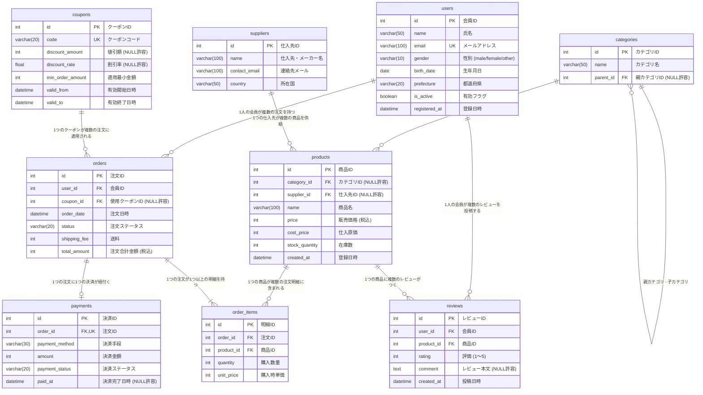

# ECサイト データベース テーブル定義書

本データベースは、SQLの各種構文（INNER/LEFT/RIGHT/FULL OUTER JOIN、GROUP BY、HAVING、集計関数、サブクエリ、ウィンドウ関数等）の学習・実践を目的として設計された架空のECサイトデータベース（SQLite3）です。

---

## 1. ER図 (Entity Relationship Diagram)

---

## 2. テーブル一覧

| テーブル名 | 論理名 | 説明 | 主なSQL学習用途 |
| :--- | :--- | :--- | :--- |
| [`users`](#1-users-会員テーブル) | 会員テーブル | ECサイトのユーザー基本情報 | 未購入ユーザー抽出 (LEFT/RIGHT JOIN), 都道府県・年代別集計 |
| [`categories`](#2-categories-商品カテゴリテーブル) | 商品カテゴリテーブル | 商品のカテゴリ分類（階層構造） | 自己結合 (親カテゴリ・子カテゴリ), 商品0件カテゴリの検出 |
| [`suppliers`](#3-suppliers-仕入先テーブル) | 仕入先テーブル | 商品の供給元・メーカー | FULL OUTER JOIN / RIGHT JOIN（商品未登録仕入先） |
| [`products`](#4-products-商品テーブル) | 商品テーブル | 取り扱い商品のマスタ | 利益率計算, 未販売商品抽出, FULL OUTER JOIN |
| [`coupons`](#5-coupons-クーポンテーブル) | クーポンテーブル | 割引クーポンマスタ | 未使用クーポン検出, クーポン利用率・効果分析 |
| [`orders`](#6-orders-注文テーブル) | 注文テーブル | ヘッダー情報（ユーザー・合計金額等） | 時系列集計 (GROUP BY 月別), ステータス集計, HAVING |
| [`order_items`](#7-order_items-注文明細テーブル) | 注文明細テーブル | 注文に含まれる商品明細 | 商品別売上集計, ウィンドウ関数 (売上ランキング), HAVING |
| [`payments`](#8-payments-決済テーブル) | 決済テーブル | 注文ごとの決済履歴 | 決済方法別比率, 未払い注文の抽出 |
| [`reviews`](#9-reviews-商品レビューテーブル) | 商品レビューテーブル | ユーザーによる商品レビュー・評価 | 平均評価点 (AVG), 高評価商品絞り込み (HAVING avg >= 4) |

---

## 3. テーブル詳細定義

### 1. `users` (会員テーブル)
会員（顧客）の情報を管理します。一部の会員は注文履歴を持たない状態で用意されています。

| カラム名 | データ型 | NULL | キー | 初期値 | 説明 |
| :--- | :--- | :---: | :---: | :--- | :--- |
| `id` | INTEGER | NO | PK | 自動採番 | 会員ID |
| `name` | VARCHAR(50) | NO | | | 氏名 |
| `email` | VARCHAR(100) | NO | UK | | メールアドレス |
| `gender` | VARCHAR(10) | YES | | NULL | 性別 (`male`, `female`, `other`) |
| `birth_date` | DATE | YES | | NULL | 生年月日 (`YYYY-MM-DD`) |
| `prefecture` | VARCHAR(20) | YES | | NULL | 都道府県 |
| `is_active` | BOOLEAN | NO | | 1 (True) | 有効会員フラグ (1: 有効, 0: 退会) |
| `registered_at`| DATETIME | NO | | CURRENT_TIMESTAMP | 会員登録日時 |

---

### 2. `categories` (商品カテゴリテーブル)
商品のジャンル・カテゴリを管理します。自己参照（`parent_id`）によって階層（親カテゴリ・子カテゴリ）を表現できます。一部カテゴリには商品が紐付いていません。

| カラム名 | データ型 | NULL | キー | 初期値 | 説明 |
| :--- | :--- | :---: | :---: | :--- | :--- |
| `id` | INTEGER | NO | PK | 自動採番 | カテゴリID |
| `name` | VARCHAR(50) | NO | | | カテゴリ名 |
| `parent_id` | INTEGER | YES | FK | NULL | 親カテゴリID (`categories.id` を参照) |

---

### 3. `suppliers` (仕入先テーブル)
商品の仕入先・製造メーカー情報を管理します。一部仕入先には商品が1点も紐付いていません（FULL OUTER JOIN / RIGHT JOIN の練習用）。

| カラム名 | データ型 | NULL | キー | 初期値 | 説明 |
| :--- | :--- | :---: | :---: | :--- | :--- |
| `id` | INTEGER | NO | PK | 自動採番 | 仕入先ID |
| `name` | VARCHAR(100) | NO | | | 仕入先企業・ブランド名 |
| `contact_email`| VARCHAR(100) | YES | | NULL | 連絡先メールアドレス |
| `country` | VARCHAR(50) | NO | | 'Japan' | 所在国 |

---

### 4. `products` (商品テーブル)
販売する商品のマスタデータです。一部の商品は仕入先やカテゴリが未設定（NULL）となっており、また一度も注文明細に登場しない商品やレビューのない商品も含まれます。

| カラム名 | データ型 | NULL | キー | 初期値 | 説明 |
| :--- | :--- | :---: | :---: | :--- | :--- |
| `id` | INTEGER | NO | PK | 自動採番 | 商品ID |
| `category_id` | INTEGER | YES | FK | NULL | カテゴリID (`categories.id` を参照) |
| `supplier_id` | INTEGER | YES | FK | NULL | 仕入先ID (`suppliers.id` を参照) |
| `name` | VARCHAR(100) | NO | | | 商品名 |
| `price` | INTEGER | NO | | | 販売単価 (税込・円) |
| `cost_price` | INTEGER | NO | | | 仕入原価 (円) |
| `stock_quantity`| INTEGER | NO | | 0 | 現在庫数 |
| `created_at` | DATETIME | NO | | CURRENT_TIMESTAMP | 商品登録日時 |

---

### 5. `coupons` (クーポンテーブル)
注文時に利用可能な割引クーポンマスタです。定額割引（`discount_amount`）または定率割引（`discount_rate`）が設定されます。

| カラム名 | データ型 | NULL | キー | 初期値 | 説明 |
| :--- | :--- | :---: | :---: | :--- | :--- |
| `id` | INTEGER | NO | PK | 自動採番 | クーポンID |
| `code` | VARCHAR(20) | NO | UK | | クーポンコード (例: `WELCOME2023`) |
| `discount_amount`| INTEGER | YES | | NULL | 定額割引額 (円) |
| `discount_rate` | FLOAT | YES | | NULL | 定率割引率 (例: 0.10 で 10%OFF) |
| `min_order_amount`| INTEGER | NO | | 0 | クーポン適用に必要な最低注文金額 (円) |
| `valid_from` | DATETIME | NO | | | 有効期間開始日時 |
| `valid_to` | DATETIME | NO | | | 有効期間終了日時 |

---

### 6. `orders` (注文テーブル)
会員からの注文ヘッダー情報です。

| カラム名 | データ型 | NULL | キー | 初期値 | 説明 |
| :--- | :--- | :---: | :---: | :--- | :--- |
| `id` | INTEGER | NO | PK | 自動採番 | 注文ID |
| `user_id` | INTEGER | NO | FK | | 注文した会員ID (`users.id` を参照) |
| `coupon_id` | INTEGER | YES | FK | NULL | 適用したクーポンID (`coupons.id` を参照) |
| `order_date` | DATETIME | NO | | CURRENT_TIMESTAMP | 注文日時 |
| `status` | VARCHAR(20) | NO | | 'pending' | ステータス (`pending`, `paid`, `shipped`, `cancelled`, `refunded`) |
| `shipping_fee`| INTEGER | NO | | 0 | 配送料 (円) |
| `total_amount`| INTEGER | NO | | | 注文総合計金額 (送料・クーポン割引適用後) |

---

### 7. `order_items` (注文明細テーブル)
1つの注文に含まれる各商品の購入数量と単価を記録します。

| カラム名 | データ型 | NULL | キー | 初期値 | 説明 |
| :--- | :--- | :---: | :---: | :--- | :--- |
| `id` | INTEGER | NO | PK | 自動採番 | 注文明細ID |
| `order_id` | INTEGER | NO | FK | | 対象の注文ID (`orders.id` を参照) |
| `product_id` | INTEGER | NO | FK | | 購入商品ID (`products.id` を参照) |
| `quantity` | INTEGER | NO | | | 購入数量 (点) |
| `unit_price` | INTEGER | NO | | | 注文確定時の販売単価 (円) |

---

### 8. `payments` (決済テーブル)
各注文の支払い情報です。

| カラム名 | データ型 | NULL | キー | 初期値 | 説明 |
| :--- | :--- | :---: | :---: | :--- | :--- |
| `id` | INTEGER | NO | PK | 自動採番 | 決済ID |
| `order_id` | INTEGER | NO | FK,UK | | 対象注文ID (`orders.id` を参照, 1対1) |
| `payment_method`| VARCHAR(30)| NO | | | 決済手段 (`credit_card`, `paypay`, `bank_transfer`, `cod`) |
| `amount` | INTEGER | NO | | | 決済金額 (円) |
| `payment_status`| VARCHAR(20)| NO | | 'pending' | 決済状態 (`completed`, `pending`, `failed`) |
| `paid_at` | DATETIME | YES | | NULL | 決済完了日時 |

---

### 9. `reviews` (商品レビューテーブル)
ユーザーが商品に対して投稿したレビューと星評価（1〜5）です。

| カラム名 | データ型 | NULL | キー | 初期値 | 説明 |
| :--- | :--- | :---: | :---: | :--- | :--- |
| `id` | INTEGER | NO | PK | 自動採番 | レビューID |
| `user_id` | INTEGER | NO | FK | | 投稿した会員ID (`users.id` を参照) |
| `product_id` | INTEGER | NO | FK | | 対象の商品ID (`products.id` を参照) |
| `rating` | INTEGER | NO | | | 評価点数 (1〜5 の整数) |
| `comment` | TEXT | YES | | NULL | レビュー本文 |
| `created_at` | DATETIME | NO | | CURRENT_TIMESTAMP | 投稿日時 |
